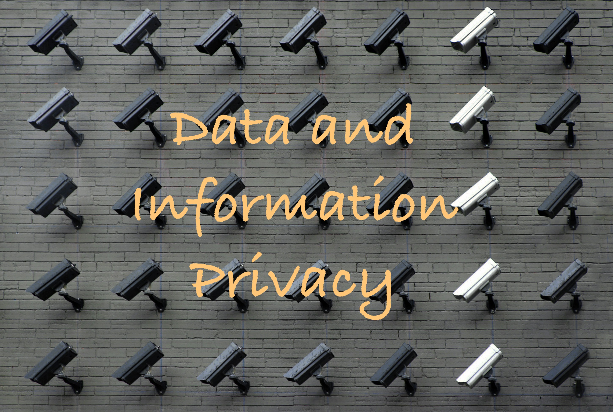

```{tableofcontents}
```

This is an online tutorial for teaching privacy mechanisms, including Differential Privacy, Causal Machine learning for data minimization, and the family of anonymization techniques (e.g., k-anonymity). This tutorial will accompany online learning platforms, and its development is supported by the National Science Foundation, Award number 2350036.
